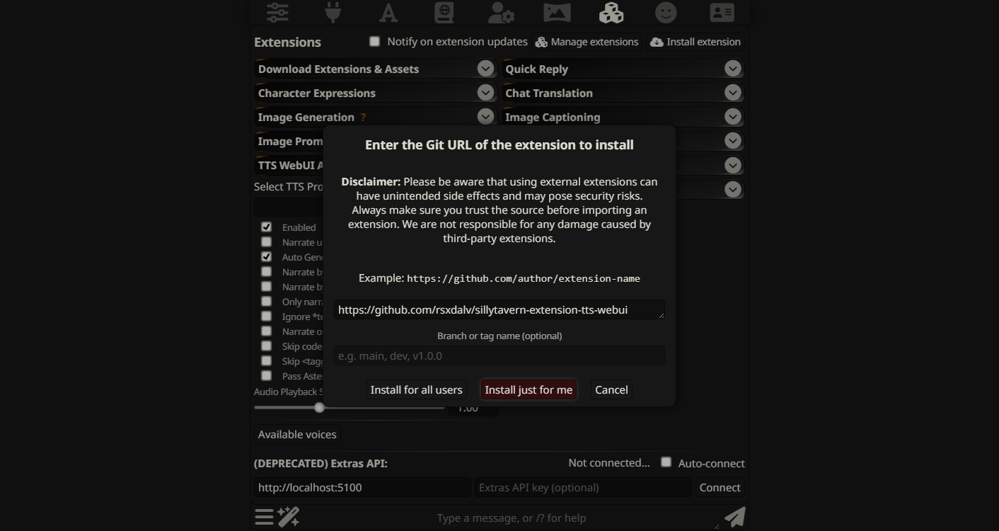
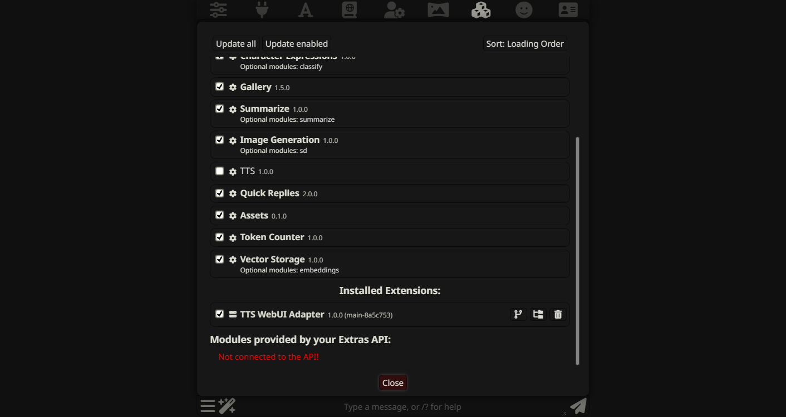

## SillyTavern TTS Extension adapted for TTS WebUI

This is an extension for [SillyTavern](https://github.com/SillyTavern/SillyTavern) that allows you to use [TTS WebUI](https://github.com/rsxdalv/tts-webui) as a TTS provider. However, it requires disabling the original TTS Extension during use, because all of the settings overlap.
Currently the only change to the system code is handling empty/invalid audio.

### Installation

Press the "Install Extension" button in the Extensions tab.
Enter this repository's URL: https://github.com/rsxdalv/sillytavern-extension-tts-webui
Then disable the original TTS extension while using this one.

# Provider Requirements.
Because I don't know how, or if you can, and/or maybe I am just too lazy to implement interfaces in JS, here's the requirements of a provider that the extension needs to operate.

### class YourTtsProvider
#### Required
Exported for use in extension index.js, and added to providers list in index.js
1. generateTts(text, voiceId)
2. fetchTtsVoiceObjects()
3. onRefreshClick()
4. checkReady()
5. loadSettings(settingsObject)
6. settings field
7. settingsHtml field

#### Optional
1. previewTtsVoice()
2. separator field
3. processText(text)
4. dispose()

# Requirement Descriptions
### generateTts(text, voiceId)
Must return `audioData.type in ['audio/mpeg', 'audio/wav', 'audio/x-wav', 'audio/wave', 'audio/webm']`
Must take text to be rendered and the voiceId to identify the voice to be used

### fetchTtsVoiceObjects()
Required.
Used by the TTS extension to get a list of voice objects from the provider.
Must return an list of voice objects representing the available voices.
1. name: a friendly user facing name to assign to characters. Shows in dropdown list next to user.
2. voice_id: the provider specific id of the voice used in fetchTtsGeneration() call
3. preview_url: a URL to a local audio file that will be used to sample voices
4. lang: OPTIONAL language string

### getVoice(voiceName)
Required.
Must return a single voice object matching the provided voiceName. The voice object must have the following at least:
1. name: a friendly user facing name to assign to characters. Shows in dropdown list next to user.
2. voice_id: the provider specific id of the voice used in fetchTtsGeneration() call
3. preview_url: a URL to a local audio file that will be used to sample voices
4. lang: OPTIONAL language indicator

### onRefreshClick()
Required.
Users click this button to reconnect/reinit the selected provider.
Responds to the user clicking the refresh button, which is intended to re-initialize the Provider into a working state, like retrying connections or checking if everything is loaded.

### checkReady()
Required.
Return without error to let TTS extension know that the provider is ready.
Return an error to block the main TTS extension for initializing the provider and UI. The error will be put in the TTS extension UI directly.

### loadSettings(settingsObject)
Required.
Handle the input settings from the TTS extension on provider load.
Put code in here to load your provider settings.

### settings field
Required, used for storing any provider state that needs to be saved.
Anything stored in this field is automatically persisted under extension_settings[providerName] by the main extension in `saveTtsProviderSettings()`, as well as loaded when the provider is selected in `loadTtsProvider(provider)`.
TTS extension doesn't expect any specific contents.

### settingsHtml field
Required, injected into the TTS extension UI. Besides adding it, not relied on by TTS extension directly.

### previewTtsVoice()
Optional.
Function to handle playing previews of voice samples if no direct preview_url is available in fetchTtsVoiceObjects() response

### separator field
Optional.
Used when narrate quoted text is enabled.
Defines the string of characters used to introduce separation between between the groups of extracted quoted text sent to the provider. The provider will use this to introduce pauses by default using `...`

### processText(text)
Optional.
A function applied to the input text before passing it to the TTS generator. Can be async.

### dispose()
Optional.
Function to handle cleanup of provider resources when the provider is switched.
